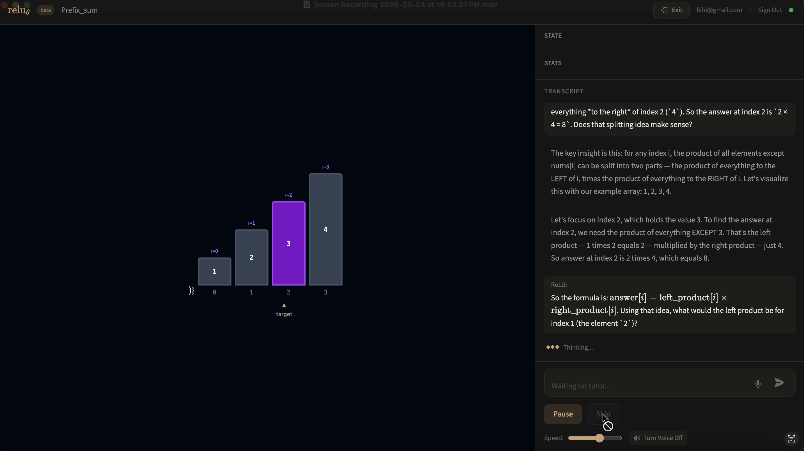
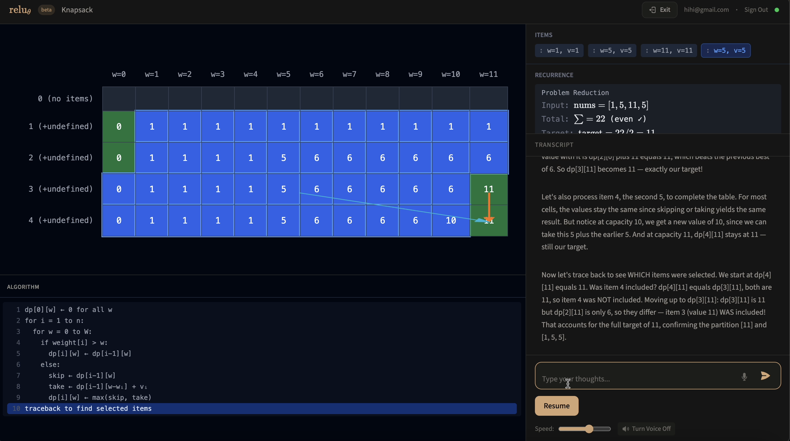
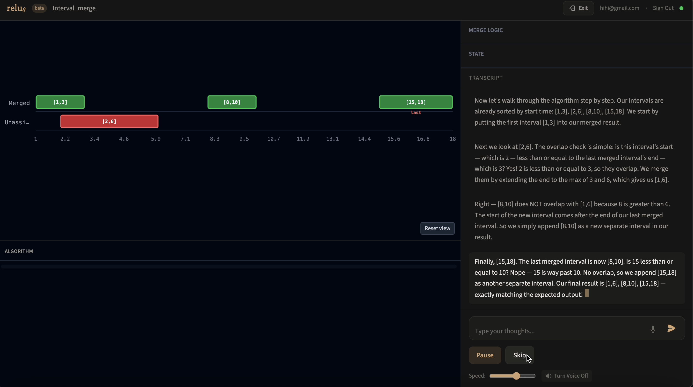
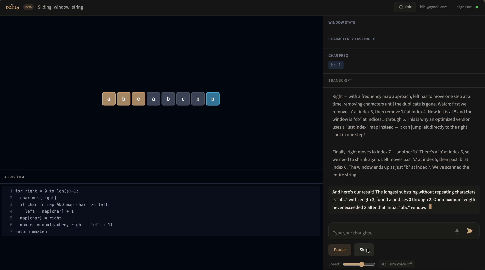
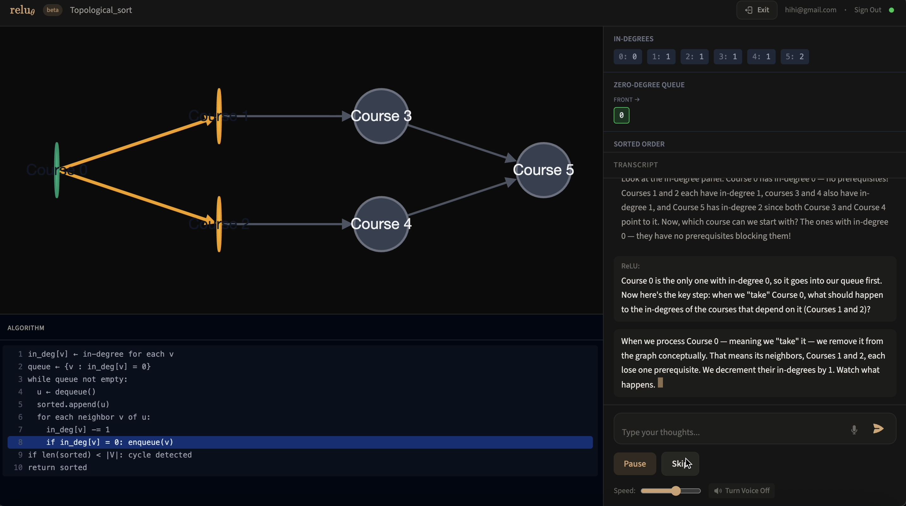

# ReLU

**Paste a LeetCode problem. Watch the algorithm animate step-by-step. Get an AI tutor that guides you toward genuine understanding — not just the answer.**

ReLU is the only tool that combines live algorithm animation with adaptive AI tutoring.

**[→ Try it live](https://relu.app)** &nbsp;·&nbsp; 10 free sessions, no credit card

---

## What makes it different

Most students grind LeetCode by brute-force repetition. ReLU replaces that with a conversation: you paste a problem, the algorithm animates in real time, and the AI tutor asks Socratic questions that lead you to understand the *pattern* — not just the solution.

The wedge moment: getting a problem right because you understood it, not because you copied it.

---

## Screenshots

A walk through five problem types ReLU handles end-to-end:

**Prefix Sum (array)**


**Knapsack (2D table DP)**


**Interval Merge (timeline)**


**Sliding Window on String**


**Topological Sort (graph)**


---

## Self-hosting

Run your own instance in four steps.

**1. Clone the repo**
```bash
git clone https://github.com/johnz4021/Relu.git
cd Relu
```

**2. Create your accounts**
- [Supabase](https://supabase.com) — free tier is fine. Run `supabase-schema.sql` in the SQL editor to create the tables.
- [Anthropic](https://console.anthropic.com/settings/keys) — for the AI tutor.

**3. Configure environment variables**
```bash
cp .env.example .env
# Fill in SUPABASE_URL, SUPABASE_SECRET_KEY, VITE_SUPABASE_URL,
# VITE_SUPABASE_PUBLISHABLE_KEY, ANTHROPIC_API_KEY, and ENCRYPTION_KEY.
# See .env.example for full docs on each variable.
```

**4. Install and run**
```bash
npm install
npm install --prefix client
npm run dev
```

Open [http://localhost:5173](http://localhost:5173).

---

## Architecture

```
ReLU/
├── server/                       # Node.js WebSocket + HTTP server
│   ├── index.js                  # WS connection handler, session gate, auth, API endpoints
│   ├── leetcodeAgent.js          # LeetCode problem classifier (Haiku)
│   ├── solver.js                 # Solver that picks the algorithm + approach
│   ├── guidedAgent.js            # AI tutor — Socratic question loop
│   ├── authorAgent.js            # Tier 2 trace generation (LLM-designed visualizations)
│   ├── agentLib.js               # Shared agent tool handlers (run_algorithm, emit_segment)
│   ├── vizMapper.js              # Maps algorithm trace steps → renderer actions
│   ├── algorithms/               # Tier 1 algorithm runners + registry
│   │   ├── registry.js           # Source of truth: 90+ algorithms with renderer + defaults
│   │   └── <category>/...        # Per-category runner implementations
│   ├── rendererManifest.js       # Renderer action docs surfaced to the LLM
│   └── rendererAdvisor.js        # Picks the right viz for ambiguous cases
├── client/                       # Vite + React
│   ├── src/App.jsx               # Root — auth, session state, WS client
│   └── src/components/
│       ├── renderers/            # Array, Graph, Tree, Table, Linked, Interval, String
│       └── Transcript.jsx        # Tutor conversation UI
└── supabase-schema.sql           # Run once in Supabase SQL editor
```

For the full pipeline (classifier → solver → tier 1/2 trace → mapper → renderer), see [`PIPELINE.md`](PIPELINE.md).

**Stack:** Node.js · WebSockets · Vite · React · Tailwind · Supabase auth · Anthropic Claude

**Session model:** 10 free sessions per account. Users who want unlimited can supply their own Anthropic key (encrypted at rest in Supabase — [see how](server/index.js)).

---

## Contributing

### Adding a new algorithm visualization

1. **Write the runner** in `server/algorithms/<category>/yourAlgo.js`. Export a `run(input)` function that returns an array of trace steps. Each step is a plain object describing the algorithm state at that moment (the first step should establish the initial structure — e.g. `{ type: 'init', graph: {...} }` or `{ type: 'init_table', rows, cols }`).

2. **Register it** in `server/algorithms/registry.js` using the existing shape:
   ```js
   your_algo: {
     run: (input) => yourAlgo(input),
     renderer: 'array',                 // 'array' | 'graph' | 'tree' | 'table' | 'linked' | 'interval' | 'string' | 'context'
     category: 'Algorithms',            // grouping label shown in UI
     defaultInput: { /* sample input */ },
     capabilities: { /* optional limits, e.g. max_array_length: 12 */ },
     // broken: true,                   // set this if the runner is incomplete; the LC classifier will skip it
   }
   ```

3. **Map the trace steps to renderer actions** in `server/vizMapper.js`. Each renderer (array / graph / tree / etc.) has a switch on `step.type` that emits actions like `set_data`, `init_grid`, `set_tree`, `highlight_node`, etc. Add a case for any new step types your runner emits. Action shapes are documented in `server/rendererManifest.js`.

4. **Test it.** Run `npm test` (Vitest). The pipeline coverage suite (`server/algorithms/pipeline.coverage.test.js`) exercises every registered algorithm end-to-end and will fail if a renderer mounts without ever receiving a structure-establishing action.

The AI tutor picks up new algorithms automatically via the LeetCode parser — no prompt changes needed.

### Other contributions

- Bug reports: open an issue with the problem text you used and the error you saw.
- New renderers, UX improvements, and accessibility fixes are welcome.

---

## License

MIT — see [LICENSE](LICENSE).
